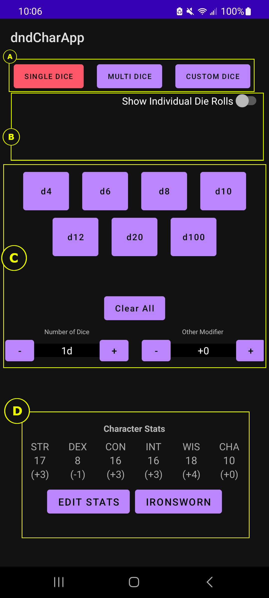

# RPG Dice Roller - Kotlin Project
## Introduction
#### Author: Steve Tamayo
This project was made in Android Studio from April 2022 - May 2022. The application allows for simulated dice rolling ranging from multiples of the same die, multiples of different dice, and custom dice inputs. The application also allows the addition of modifiers before OR after the dice roll.

My inspiration for this project was that I wanted to add Kotlin to my toolbelt as a software developer and my hobbies of various TableTop Role Playing Games (TTRPGs) including Dungeons & Dragons, Ironsworn, and GURPs. 

#  Using the App

  &nbsp;&nbsp;

The app is divided into four main parts: 
[A. Tabs](#pt1) 
[B. Display](#pt2) 
[C. Dice Buttons](#pt3) 
[D. Character Stats](#pt4) 

## A. Tabs

The app has three modes. By default, the app opens in "SINGLE DICE" mode. The current mode's tab button will be red when in use. Click one of the following to jump to a particular "mode" to learn more:

1. [Single Dice Tab](#sdt) 
2. [Multi Dice Tab](#mdt) 
3. [Custom Dice Tab](#cdt) 

## B. Display

When rolling dice, text will appear here declaring what kind of dice and modifiers are applying to the roll. *Note that in "MULTI DICE" mode, the text will update as you add to the "pool", saying "Rolling" instead of "Rolled" until you hit the "Roll" button in that mode.

The total of the roll plus any modifiers will appear centered below this. You can also toggle "Show Individual Die Rolls" to see what each die rolls separately.

[Jump to Top](#top) 

## C. Dice Buttons

This section's UI changes depending on which tab/mode you are currently displaying. These will be touched upon more in the mode section.

[Jump to Top](#top) 

## D. Character Stats

The default stats are in a format that matches a Dungeons and Dragon's character scores. By pressing one of these six scores, the modifier will be added to the roll. This can be toggled before or after the roll is made. 

  &nbsp;&nbsp;

You can edit the stats by using the "EDIT STATS" button:

  &nbsp;&nbsp;

After editing your stats, hit "SAVE STATS" to apply your changes (or hit "RETURN WITHOUT SAVING" to cancel changes).

[Jump to Top](#top) 

### Single Dice Tab

This tab has buttons for a standard set of TTRPG dice (4-, 6-, 8-, 10-, 12-, 20-, 100-sided dice). Each button in the middle has the text "d" and a number, indicating how many sides that die has. 

In this "SINGLE DICE" mode, When you press one of these buttons, the app will randomize the results of the roll of that die.

  &nbsp;&nbsp;

  &nbsp;&nbsp;

Below these seven buttons is a "Clear All" button. This will clear the results of any dice rolled.

Below the "Clear All" button are two sets of minus and plus buttons. The left one will determine the Number of Dice rolled when clicking one of the seven above buttons. The minimum number you can roll is 1.

The right one will add a generic modifier, including negative numbers. (This will stack with Character Stats and the text will list them seperately).

[Jump to Top](#top) 

### Multi Dice Tab

This tab has buttons for a standard set of TTRPG dice (4-, 6-, 8-, 10-, 12-, 20-, 100-sided dice). Each button in the middle has the text "d" and a number, indicating how many sides that die has. 

In this "MULTI DICE" mode, dice will be added to a "rolling pool".

The plus and minus buttons will determine if you are adding or removing dice from the pool.

When the dice pool is ready, press the "Roll" button, which will randomize each individual die roll. 

Below these ten buttons is a "Clear All" button. This will clear the results of any dice rolled and in the pool.

Below the "Clear All" button are two sets of minus and plus buttons. The left one will determine the Number of Dice rolled when clicking one of the seven above buttons. The minimum number in this field 1 (displayed as 1d).

The right one will add a generic modifier, including negative numbers. (This will stack with Character Stats and the text will list them seperately).

[Jump to Top](#top) 

### Custom Dice Tab

This tab has an input text box for the user to enter their own custom dice roll using a "xdy format", with "x" being the number of dice and "y" being the number of sides. 

This also allows for multiple dice and modifiers to be entered. For example, if you wanted to roll a 35-sided dice, two 8-sided dice, three 19-sided dice, add 20, and add your Character's CON modifier (see Character Stats) you would add it as such:

  &nbsp;&nbsp;
  

The input will only accept the letter "d", numbers, and the plus (+) symbol, displaying a pop-up saying there is something wrong with the input. It will also pop-up if it detects two or more "d"s next to each other.

[Jump to Top](#top) 
